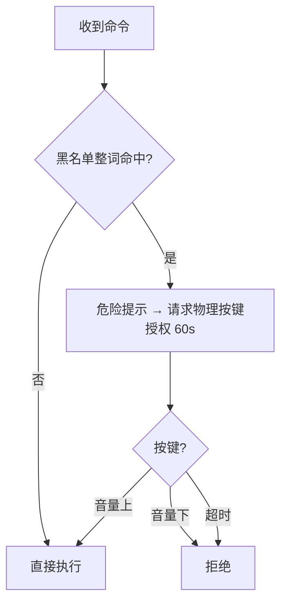
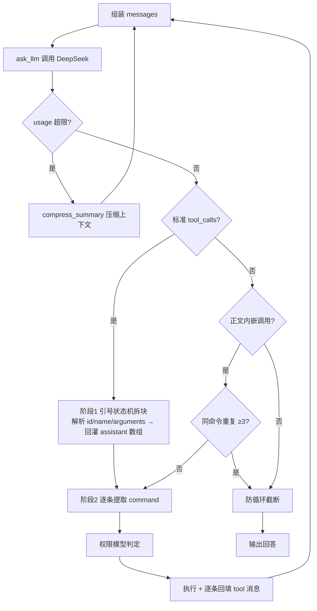

<div align="center">

# Agent For Shell

**一个 .sh，部署agent。**

DeepSeek 驱动的终端 agent · 跑在  幻•实验室终端
默认仅支持param参数实现


</div>

---

## 是什么

一个 `.sh` 文件部署完整 agent。只要 `curl` + `awk` + `sed` + `grep`（Android / adb shell 全内置），零依赖、超轻量，头部三个参数即配即用。

## 特性

- **批量调用** — 一次响应可发多条 `tool_calls`（建议 ≤8 条），脚本按序执行、逐条回填结果，不用等上一条返回
- **工具闭环** — 标准 `tool_calls` 批量捕获 + 正文内嵌调用双通道；解析失败自动回灌原文，引导模型自纠，不空转
- **物理按键授权** — 黑名单命令需物理按键确认：音量上=同意 / 音量下=拒绝 / 60s 无操作自动拒绝
- **零依赖** — 纯 POSIX sh，仅 `curl` `awk` `sed` `grep`，无 Python / 无 Node / 无第三方库
- **上下文压缩** — token 超限自动 summarize 历史为摘要，长会话不断链
- **记忆系统** — 自动读写 `/data/local/tmp/agent_mem/YYYYMMDD.md`，跨会话复用结论
- **默认继承 adb 权限** — 直接跑 `dumpsys` / `getprop` / `settings` / `pm` / `am` 等系统命令

## 权限模型



> 黑名单：`rm` `dd` `mkfs` `format` `wipe` `reboot` `shutdown` `su` `mount` `chmod` `chown` `killall` `pm uninstall` `pm clear` `settings put` `setprop`

## 循环模型



## 快速开始

```bash
# 1. 下载（MT 终端 / adb shell / 幻·实验室 均可）
curl -L -o agent.sh "https://raw.githubusercontent.com/Xiyinnnnnn/Agent-For-Shell/main/Agent%20For%20Shell.sh"

# 2. 编辑头部参数
# #param: API_KEY|DeepSeek API Key|sk-xxx
# #param: QUESTION|本次问题|帮我看看设备信息

# 3. 跑
sh agent.sh
```

### 参数

| 参数 | 默认值 | 说明 |
|------|--------|------|
| `API_KEY` | — | DeepSeek API Key（必填） |
| `QUESTION` | `你好` | 本次问题 |
| `MODEL` | `deepseek-v4-flash` | 模型名 |

## 环境要求

- Android 终端：幻·实验室
- 工具：`curl` `awk` `sed` `grep`（MT 扩展包、Termux 均内置）
- 物理按键授权需 `getevent`（root / shell 权限）

## License

[MIT](LICENSE) © Xiyinnnnnn
