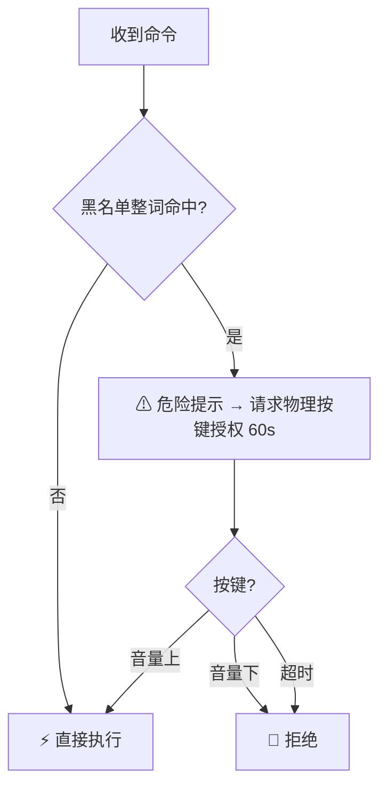
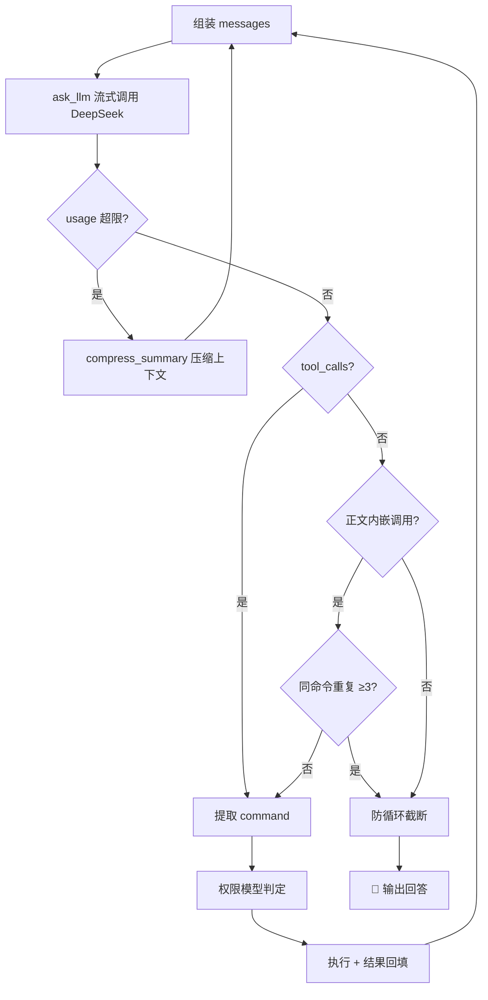

<div align="center">

# ⚡ Agent For Shell

**一个 .sh，让终端拥有 agent。**

DeepSeek 驱动的终端 agent · 跑在 MT 管理器终端 / 幻·实验室 / adb shell


</div>

---

## 是什么

单文件 POSIX sh 终端 agent。你说话，它思考，**它自己执行命令**，结果回传，继续思考。

没有 Node。没有 Python。没有 jq。只要 `curl` + `awk` + `sed` + `grep`。

## 特性

- 🧠 **工具闭环** — 标准 `tool_calls` + 正文提取双通道，模型跑不偏
- 🔐 **物理按键授权** — 危险命令必须按音量键，物理世界最后一道闸
- 📦 **零依赖** — 纯 sh，任何 Android shell 环境直接跑
- 🧯 **防循环** — 同一命令重复 3 次自动截断，不让模型原地打转
- 📉 **上下文压缩** — token 超限自动 summarize，长会话不爆
- 💾 **记忆回填** — 每轮结果回灌 messages，模型记得住上下文

## 权限模型



> 黑名单：`rm` `dd` `mkfs` `format` `wipe` `reboot` `shutdown` `su` `mount` `chmod` `chown` `killall` `pm uninstall` `pm clear` `settings put` `setprop`

## 循环模型



## 快速开始

```bash
# 1. 下载（MT 终端 / adb shell / 幻·实验室 均可）
curl -L -o agent.sh "https://raw.githubusercontent.com/Xiyinnnnnn/Agent-For-Shell/main/Agent%20For%20Shell.sh"

# 2. 编辑头部参数
# #param: API_KEY|DeepSeek API Key|sk-xxx
# #param: QUESTION|本次问题|帮我看看设备信息

# 3. 跑
sh agent.sh
```

### 参数

| 参数 | 默认值 | 说明 |
|------|--------|------|
| `API_KEY` | — | DeepSeek API Key（必填） |
| `QUESTION` | `你好` | 本次问题 |
| `MODEL` | `deepseek-v4-flash` | 模型名 |

## 环境要求

- Android 终端：MT 管理器终端模拟器 / 幻·实验室 / adb shell
- 工具：`curl` `awk` `sed` `grep`（MT 扩展包、Termux 均内置）
- 物理按键授权需 `getevent`（root / shell 权限）

## License

[MIT](LICENSE) © Xiyinnnnnn
